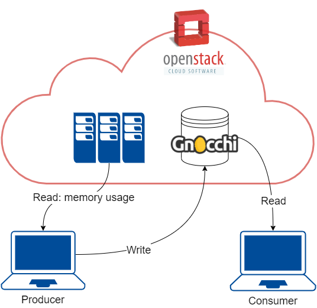

# Run our paramount Vallati Project by yourself!

## The project
OpenStack: Timeseries as a service
Gnocchi is an open-source, multi-tenant timeseries, metrics and resources database. It provides an HTTP REST interface to create and manipulate the data. It is designed to store metrics at a very large scale on CEPH while providing access to metrics and resources information and history.
Install in an OpenStack instance the Gnocchi database and create two simple applications, one consumer and one producer, that exploit the REST interface exposed by Gnocchi to store/retrieve the data. The producer must mimic the periodic production of measurement data (random data is OK) to be stored in the timeseries database, the consumer must retrieve periodically some aggregated values like average, max, min, etc.



## Gnocchi

We created 5 metrics on gnocchi db, one for each machine,
the archive policy is set to **medium**, this will permit to get the data choosing between two different granularities:

- 1 minute granularity over 7 days
- 1 hour granularity over 365 days

## Hands on

Connect to the Controller trought the VPN: **172.16.3.28**

In **/root** you will find:

```sh
root@G2LT74AKPEAN2NI:~# ls
consumer  producer 
```

```sh
root@G2LT74AKPEAN2NI:~/consumer# ls
config.json  consumer.py  Dockerfile
```

```sh
root@G2LT74AKPEAN2NI:~/producer# ls
config.json  producer.py  Dockerfile
```

Go to **producer/** directory:

Build the customized image starting from the dockerfile
```sh
docker built -t producer .
```

Run the container with the **-it** parameter to see the script output in realtime:
```sh
 docker run -it producer
```
    
Run the container in background with the **-d** parameter:
```sh
 docker run -d producer
```

Go to **consumer/** directory:

Build the customize image of the consumer starting from the dockerfile:

```sh
docker built -t consumer .
```

Run the container showing the shell of the consumer since the user will have to set some parameters and data will be print:

```sh
docker run -it consumer
```


The user will now be able to set some parameters and read every 30 seconds the periodic updates of the producer:

```sh
root@G2LT74AKPEAN2NI:~/consumer# docker run -it consumer
Please, chose a kind of aggregation:

1) Mean
2) Min
3) Max
1
Please, chose a granularity:

1) Minute
2) Hour
1

Host: 172.16.1.210

+---------------------------+-------------+--------------------+
|         Timestamp         | Granularity |        MEAN        |
+---------------------------+-------------+--------------------+
| 2020-07-07T19:20:00+00:00 |     60.0    | 35.89666666666667  |
| 2020-07-07T19:21:00+00:00 |     60.0    |       35.87        |
| 2020-07-07T19:22:00+00:00 |     60.0    |       35.88        |
| 2020-07-07T19:23:00+00:00 |     60.0    | 35.88666666666667  |
| 2020-07-07T19:24:00+00:00 |     60.0    | 36.160000000000004 |
+---------------------------+-------------+--------------------+

```


Stop all the containers:
```sh
docker stop $(docker ps -a -q)
```
## Consumer Dockerfile:

From an Ubuntu image install python3 and the dependencies, move the script files inside the image, then run the consumer.py script:

```
FROM ubuntu
ADD ./config.json /root/
ADD ./consumer.py /root/
RUN apt-get update && apt-get install -y python3.8
RUN apt update
RUN apt install -y python3-pip
RUN pip3 install paramiko && pip3 install keystoneauth1 && pip3 install prettytable
CMD ["/usr/bin/python3", "/root/consumer.py"]
```
## Producer Dockerfile:

```
FROM ubuntu
ADD ./config.json /root/
ADD ./producer.py /root/
RUN apt-get update && apt-get install -y python3.8
RUN apt update
RUN apt install -y python3-pip
RUN pip3 install paramiko && pip3 install keystoneauth1
CMD ["/usr/bin/python3", "/root/producer.py"]

```

## config.json 
Is read by both the producer and the consumer.
Contains the credentials information of the cloud machines from where to retrieve the memory_usage percentuals.
Also the id of the metric reserved for each machine is stored.

```json
{
    "hosts": [
        {
            "ip": "172.16.3.28",
            "user": "root",
            "password": "valle",
            "metric": "a657d89e-a2d0-458b-b457-d600a7e95ca6"
        },
        {
            "ip": "172.16.2.46",
            "user": "root",
            "password": "tonno",
            "metric": "b9bfa0f2-8f41-4f9c-9eae-af798ff30ba4"
        },
        {
            "ip": "172.16.1.210",
            "user": "root",
            "password": "lorenzo",
            "metric": "f0272162-f2c4-4128-b1af-4e6dc46b64f1"
        },
        {
            "ip": "172.16.1.133",
            "user": "root",
            "password": "matilde",
            "metric": "beb1759e-a83b-4a29-b392-3fde6349f1c6"
        },
        {
            "ip": "172.16.1.211",
            "user": "root",
            "password": "bifecco",
            "metric": "156dbcc4-6141-45ed-9db3-fc482833f955"
        }
    ]
}
```

producer.py

do this

consumer.py

do this